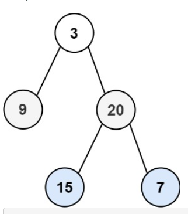

### **Problem Statement**

Given two integer arrays preorder and inorder where preorder is the preorder traversal of a binary tree and inorder is the inorder traversal of the same tree, construct and return the binary tree.


**Example 1:**



```
Input: preorder = [3,9,20,15,7], inorder = [9,3,15,20,7]
Output: [3,9,20,null,null,15,7]
```

**Example 2:**
```
Input: preorder = [-1], inorder = [-1]
Output: [-1]
```

**Constraints:**

* 1 <= preorder.length <= 3000
* inorder.length == preorder.length
* -3000 <= preorder[i], inorder[i] <= 3000
* preorder and inorder consist of unique values.
* Each value of inorder also appears in preorder.
* preorder is guaranteed to be the preorder traversal of the tree.
* inorder is guaranteed to be the inorder traversal of the tree.

---
### **Appraoch**

> Pre order traversale is the path it takes to go to the leaf node. In order Traversal start with the left node and construct from bottom to up, from left to right. 

* Let Inorder traversal array be $I$ and pre order traversal array be $P$. 
* Let current element we are looking at for both array be at $i, j$. 
* Increment $i$ from $0$ until $I[i] == P[j]$

